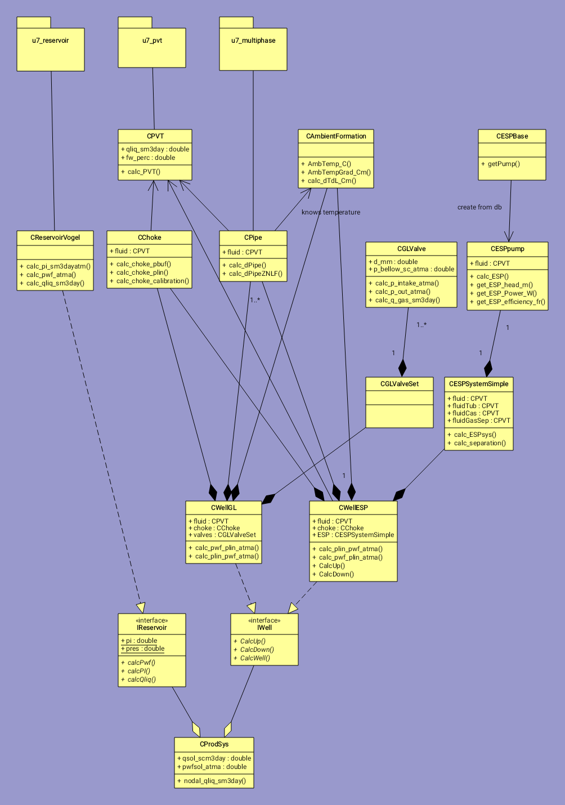

# UNIFLOC VBA #

Анализ работы скважины и скважинного оборудования 
с использованием VBA макросов Excel.
* Инженерные расчеты по добыче Унифлок VBA
* Версия 7.7

### Объектная модель ###

Ключевые классы реализующие расчетные функции приведены на диаграмме классов.

### Контакты ###

* Хабибуллин Ринат
* khabibullin.ra@gubkin.ru

