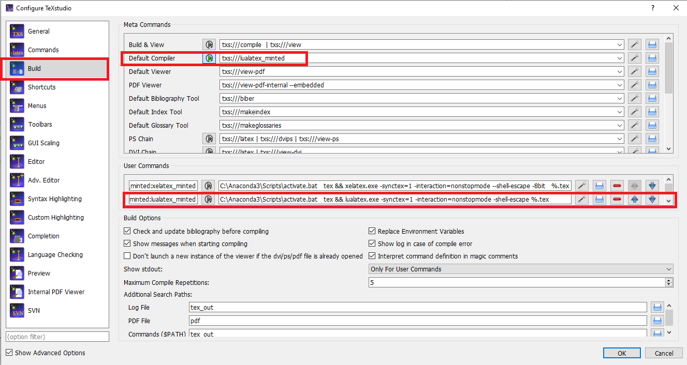

# UNIFLOC VBA #

* Инженерные расчеты по добыче Унифлок VBA
* Версия 7.7

В папке `docs` содержатся исходные файлы руководство пользователя системы Unifloc VBA в формате LaTeX. 

## Установка LaTeX для редактирования руководства пользователя ###

Перечень рекомендуемого программного обеспечения для редактирования

* MikTex дистрибутив для установки LaTeX  https://miktex.org/ 
* TexStudio - удобный редактор для редактирования  https://texstudio.org/
* Python с установленным пакетом `pygments` для генерации листингов кода с подсветкой синтаксиса. 
 
 Необходимо установить перечисленное программное обеспечение. При наличии уже установленной системы LaTeX рекомендуется обновить пакеты до последней версии.
 
 ### Установка `pygments` для python в отдельное окружение
 
Подстветка синтаксиса в листингах исходного кода руководства пользователя реализована с использованием пакета `minted`, который в свою очередь использует python пакет `pygments`. Для корректной работы версия python с установленным `pygments` должна быть доступна из консоли. 

При работе со сборкой anaconda это может быть достигнуто созданием отдельного окружения conda, например с названием `tex`.

1. запустите 

`anaconda promt`

2. выполните команду для создания окружения с названием tex 

`conda create -n tex` 

3. активируйте созданное окружение 

`activate tex` 

4. установите пакет pygments 

`pip install pygments`

после этого пакет `pygments` должен быть готов к работе

### Настройка TexStudio 

Для компиляции документа необходимо использовать LuaLaTex. 
Команда компиляции для может выглядеть следующим образом

`C:\Anaconda3\Scripts\activate.bat   tex && lualatex.exe -synctex=1 -interaction=nonstopmode -shell-escape %.tex`

команда состоит из нескольких команд выполняемых последовательно.  
* `C:\Anaconda3\Scripts\activate.bat   tex ` активирует в консоли окружение `tex` 
* команда `&&` в консоли windows разделяет две последовательные команды, которые будут выполнены одна за другой 
* `lualatex.exe -synctex=1 -interaction=nonstopmode -shell-escape %.tex` запускает lualatex, опция `-shell-escape` необходима для запуска python при необходимости

команду можно настройть в далоге Configure TeXStudio как показано на рисунке

### Контакты ###

* Хабибуллин Ринат
* khabibullin.ra@gubkin.ru

